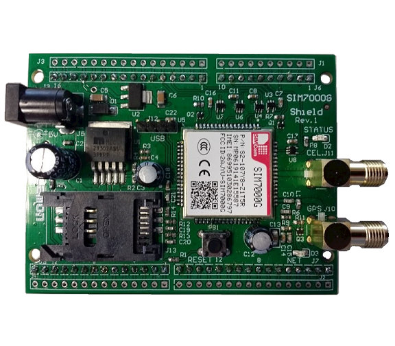

## App to work with SIM7000

## List of functionalities
<ul>
  <li>Send a message to a cellphone</li>
  <li>Get device info</li>
</ul>


<h4>Module used to do the tests </h4>


<p align="center">
  
</p>


<h4>How to use this code </h4>


You need to run the command:
```c
./runCode.sh  //while outside the app folder. 
              //Maybe you should give execute permission to the runCode.sh file.
```

